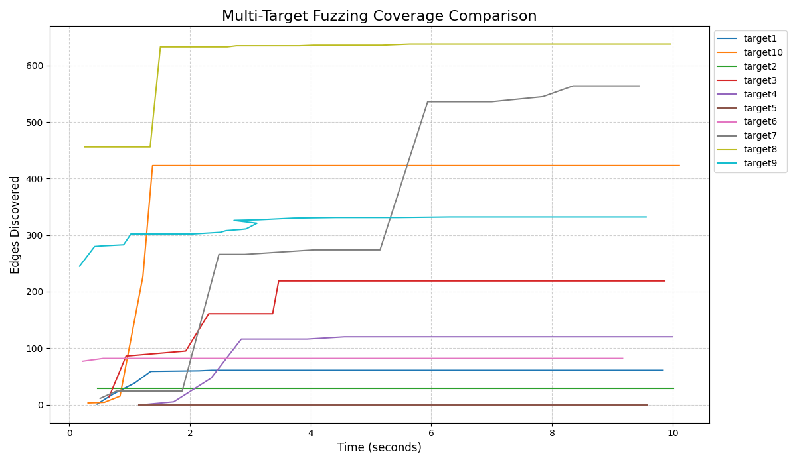

# Fuzzing 实验多目标测试报告

## 1. 测试汇总表格

| 目标名称 | 最终覆盖边数 | 测试耗时 (s) |
| :--- | :--- | :--- |
| target1 | 61 | 9.83 |
| target10 | 423 | 10.11 |
| target2 | 29 | 10.01 |
| target3 | 219 | 9.87 |
| target4 | 120 | 10.00 |
| target5 | 0 | 9.57 |
| target6 | 82 | 9.17 |
| target7 | 564 | 9.44 |
| target8 | 638 | 9.96 |
| target9 | 332 | 9.56 |

## 2. 覆盖率增长对比图

